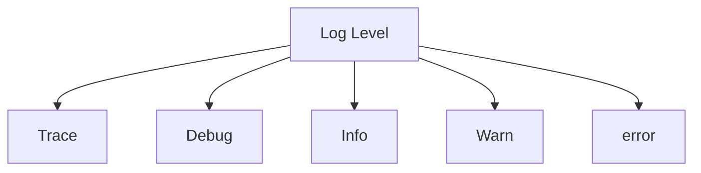

# AEM Log

```java
import org.slf4j.Logger;
import org.slf4j.LoggerFactory;
```

## Log level


<em> &nbsp;&nbsp;&nbsp;&nbsp;=====  Only Log from choosen level to last level(error) will print ======> &nbsp;&nbsp;&nbsp;&nbsp;</em> 

## Log support in AEM
{width=400}


## Logging Writer
`/system/console/configMgr` >> `Apache Sling Logging Writer Configuration`

### Two patterns
{width=600}

{width=600}
