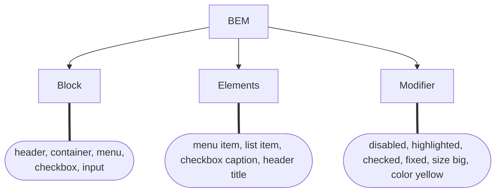

# BEM

> [BEM](https://getbem.com/) — Block Element Modifier is a methodology that helps you to create reusable components and code sharing in front-end



## `Block`

- **Naming** <br>
  Block Standalone entity that is meaningful on its own.. names may consist of Latin letters, digits, and dashes. To form a CSS class.
	
	- namespacing: `.block`
	- Any DOM node can be a block if it accepts a class name. <br>`HTML` - ` <div class="block">...</div>`
	- Use class name selector only / No tag name or ids / No dependency on other blocks/elements on a page <br>`CSS` - `.block { color: #042; }`

- **Element** <br>
Parts of a block and have no standalone meaning. Any element is semantically tied to its block	

 	- naming: `.block__elem `
	- Any DOM node within a block can be an element. Within a given block, all elements are semantically equal. <br>
	- 
	```html
	<div class="block">
	  ...
	  <span class="block__elem"></span>
	</div>
	```

 	- Same as `Block` <br> 
		*Good*
		```css
		.block__elem { color: #042; }
		```
		*Bad*
		```css
		.block .block__elem { color: #042; }
		div.block__elem { color: #042; }
		```

- **Modifier** <br>
  Flags on blocks or elements. Use them to change appearance, behavior or state.

	- naming:  <br>
	`CSS` class is formed as block’s or element’s name plus two dashes: `.block--mod` or `.block__elem--mod` and `.block--color-black` with `.block--color-red`
	- HTML <br>
  Modifier is an **extra** class name which you add to a `block/element` DOM node. Add modifier classes only to `blocks/elements` they modify, and keep the original class: <br>
	*Good*  <br>
		```html
			<div class="block block--mod">...</div>
			<div class="block block--size-big block--shadow-yes">...</div>
		```
		*Bad* <br>
		```html
			<div class="block--mod">...</div>
		```
	- CSS <br>

		- Use modifier class name as selector: `.block--hidden { }`
		- To alter elements based on a block-level modifier: `.block--mod .block__elem { }`
		- Element modifier: `block__elem--mod { }`

## Examples
### HTML
```html
<form class="form form--theme-xmas form--simple">
  <input class="form__input" type="text" />
  <input
    class="form__submit form__submit--disabled"
    type="submit" />
</form>
```

### CSS
```css
.form { }
.form--theme-xmas { }
.form--simple { }
.form__input { }
.form__submit { }
.form__submit--disabled { }

```

