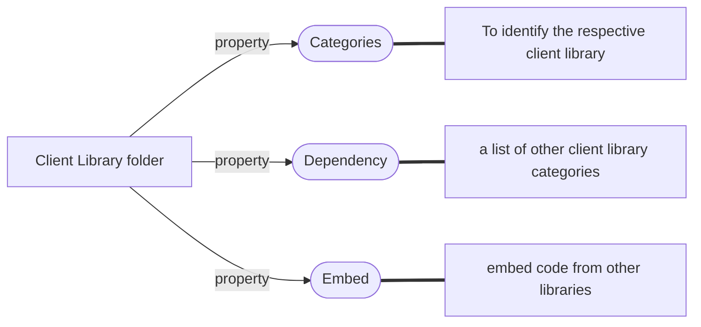
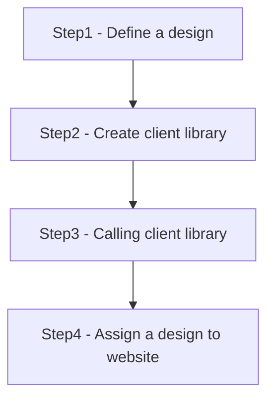
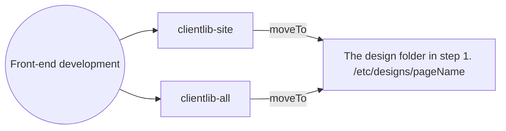
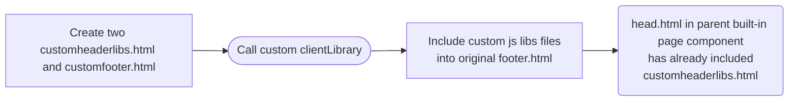

# Client Library

- Manage all client side resources(js, css, images etc)
- Keep resources in CRX repository

## How to reference client-side libraries in HTL?

```html
<!DOCTYPE html>
<html data-sly-use.clientlib="/libs/granite/sightly/templates/clientlib.html">
  <head>
    <!-- Load css -->
    <sly data-sly-call="${clientlib.css @ categories='myCategory'}" />

    <!-- Load all -->
    <sly data-sly-call="${clientlib.all @ categories='myCategory'}" />
  </head>
  <body>
    <!-- Load JS -->
    <sly data-sly-call="${clientlib.js @ categories='myCategory'}" />
  </body>
</html>
```

> All `client-side libraries` will be included in `clientlib.html`.

## clientlibs structure

{width=600}

## Useful Properties



{width="800"}

## How to create Client Library?



### Step1 - Define a design

> design folder is at _/etc/designs_

#### how to define a desgin?

`AEM pannel` >> `Tools` >>`Operations` >> `Configuration` or `locahost:4502/miscadmin` >> `Designs` >> `new page` >>`page will go to /etc/desgins`

### Step2 - [Create client library](https://experienceleague.adobe.com/docs/experience-manager-64/developing/introduction/clientlibs.html?lang=en#creating-client-library-folders)



 <br>
<sup>\* Data from [adobe document](https://experienceleague.adobe.com/docs/experience-manager-64/developing/introduction/clientlibs.html?lang=en#creating-client-library-folders)</sup>

### Step3 - Calling client library

```html
<sly
  data-sly-use.clientlib="/libs/granite/sightly/templates/clientlib.html"
  data-sly-call="${clientlib.all @ categories=['myCategory1', 'myCategory2']}"
/>
```



### Step4 - Assign a design to a website

`AEM pannel` >> `Sites` >> `Project` >> `View Properties` >> `Advanced` >> `Design` >> `Select design` >> `Back to page` >> `check the result`

## Minify clientlibs files
{width=600}
