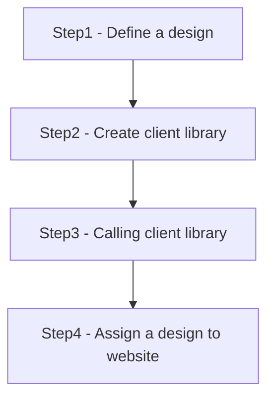

# Client Library

- Manage all client side resources(js, css, images etc)
- Keep resources in CRX repository

## How to reference client-side libraries in HTL?
```html
<!doctype html>
<html data-sly-use.clientlib="/libs/granite/sightly/templates/clientlib.html">
    <head>
        <!-- Load css -->
        <sly data-sly-call="${clientlib.css @ categories='myCategory'}"/>

        <!-- Load all -->
        <sly data-sly-call="${clientlib.all @ categories='myCategory'}"/>
        
    </head>
    <body>
        <!-- Load JS -->
        <sly data-sly-call="${clientlib.js @ categories='myCategory'}"/>
    </body>
</html>

```
> All `client-side libraries` will be included in `clientlib.html`.

## Useful Properties


## How to create Client Library?


### Step1 - Define a design

> design folder is at */etc/designs*

#### how to define a desgin?
`AEM pannel` >> `Tools` >>`Operations` >> `Configuration` or `locahost:4502/miscadmin` >> `Designs` >> `new page` >>`page will go to /etc/desgins`

