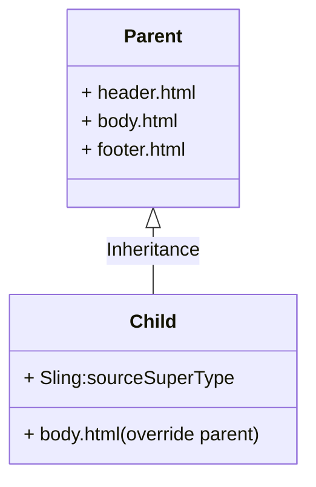

# Components

## What is Component?
`AEM` provides tons of OTB `core components` residing in */libs/wcm/foundation/componets* (`AEM clouds` might be different). 

- Collection of scripts
- a reusable unit 
- modular
  
> Componnet is a foundation unit of *Template/Page*.

## Inheritance

All components inherit functionalities e.g. setting box,  from  `sling:resourceSuperType`. The file with same name as parent component will override it.

