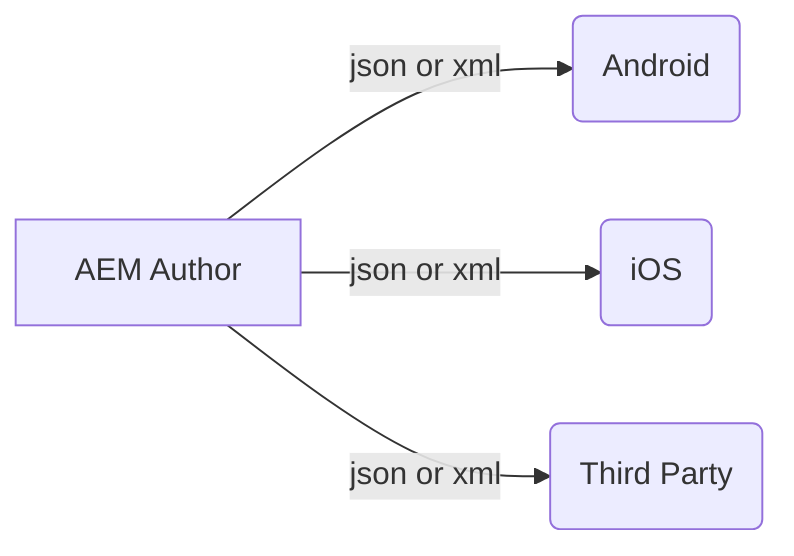

# AEM Content Exporter Service

*Sling Model Exporter*
> since 6.3, AEM provides content exporter service to export json or xml to headless application.  
AEM provides an OTTB content exporter - jackson

## How to make a sling model as an Exporter?

- image from <a href="https://www.youtube.com/c/AEMGeeks" target="_blank">AEM GEEKS</a>

> If the selector is not provided, AEM'll provide a default selector called "model". selector property is optional.

