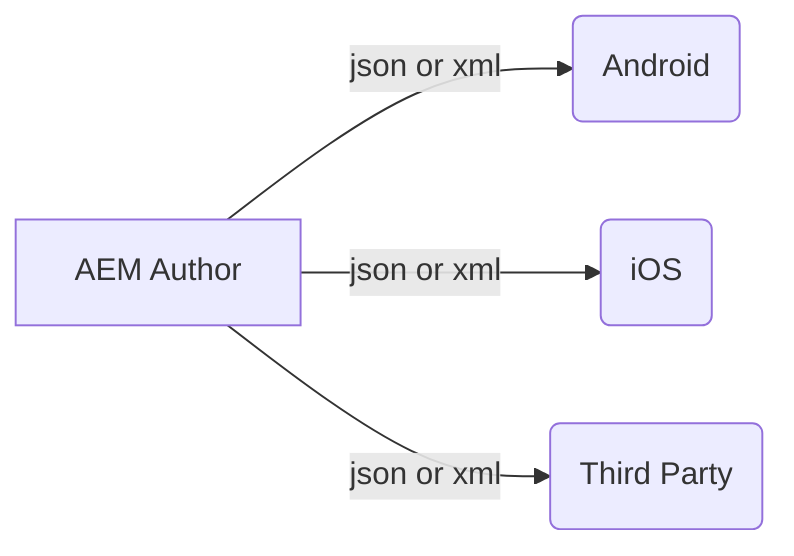
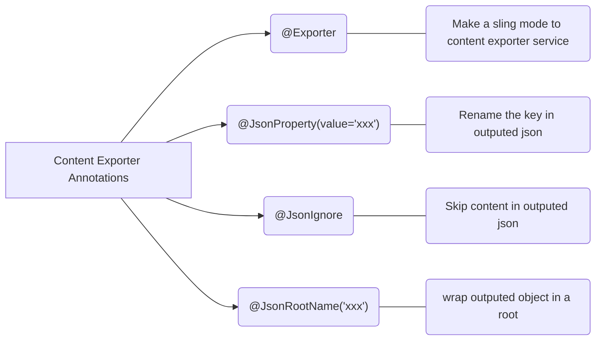
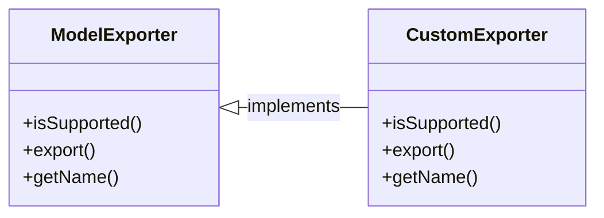
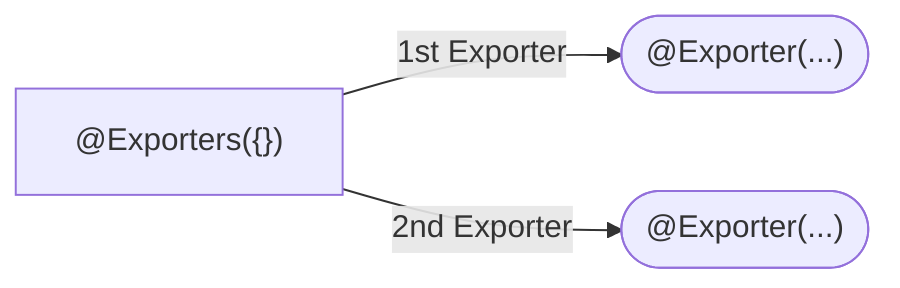

# AEM Content Exporter Service

_Sling Model Exporter_

- since 6.3, AEM provides content exporter service to export json or xml to headless application.
- AEM provides an OTTB content exporter - jackson
- By default, AEM outputs all properties in json format by NodeName.json



{width=500}

<p><sup>- image from <a href="https://experienceleague.adobe.com/docs/experience-manager-learn/foundation/development/understand-sling-model-exporter.html?lang=en" target="_blank">adobe</a></sup></p>

## How to make a sling model as an Exporter?


<p><sup>- image from <a href="https://www.youtube.com/c/AEMGeeks" target="_blank">AEM GEEKS</a></sup></p>

> - If the selector is not provided, AEM'll provide a default selector called "model". selector property is optional.

- resourceType should be the same as resourceType of the content node.

## Content Exporter Annotations



## Custom Sling Model Exporter



### How to create a custom Exporter?

<details>
<summary>Step 1 - Create a new Exporter service implements ModelExporter</summary>

<p class="call-out-2"><a href="https://www.javatpoint.com/jaxb-tutorial" target="_blank">JAXB</a> is used for XML</p>

```java
@Component(service = ModelExporter.class)
public class XmlExporter implements ModelExporter {
  @Override
  public boolean isSupported(Class<?> clazz) {
    return true;
  }

  @Override
  public <T> T export(Object model, Class<T> clazz, Map<String, String> options) throws ExportException {
    ....
  }

  @Override
  public String getName() {
    return "customExporterName";
  }
}
```

</details>

<details>
<summary>Step 2 - Convert a sling mode to Exporter using custom Exporter service</summary>

```java
@Model(
        adaptables = Resource.class,
        adapters = IAdminXML.class,
        resourceType = "htlblog/admin/list",
        defaultInjectionStrategy = DefaultInjectionStrategy.OPTIONAL
)
@Exporter(name = "customExporterName", extensions = "xml", selector = "geeks",
        options = {
                @ExporterOption(name = "SerializationFeature.WRAP_ROOT_VALUE", value = "true")
        }
)
@XmlRootElement(name = "admin")
public class IAdminXML {
  @ValueMapValue
  @XmlElement
  String title;

  @ValueMapValue
  @XmlElement
  String description;

  public String getTitle() { return title; }

  public String getDescription() { return description; }
}

```

</details>

## Multiple Sling Exporters



<details>
<summary>Multi Exporters Demo</summary>
```java
@Exporters({
        @Exporter(name = "jackson", extensions = "json", selector = "geeksjson"),
        @Exporter(name = "geeksxml", extensions = "xml", selector = "geeksxml")
})
```
</details>
