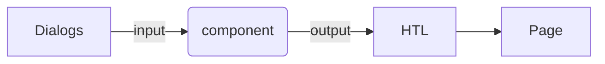

# Dialog

> Dialogs is a part of the component as they provide an UI for authors to configure and provide input to that component.



## cq:dialog

> Component Level

### multifield dialog

#### JCR structure


<p><sup>- image from <a href="https://www.youtube.com/c/AEMGeeks" target="_blank">AEM GEEKS</a></sup></p>

<p class="call-out-2">
NOTE: composite property as true is used in a single mulifields and field will be a property in arrays, while false value is used in multi multifields and field will be a child node.
</p>

#### Dialog structure


<p><sup>- image from <a href="https://www.youtube.com/c/AEMGeeks" target="_blank">AEM GEEKS</a></sup></p>

#### Dialog multifield with map

<p class="call-out-2">
When do we use map to handle dialog multi multifields?   <br>
all fields share the same date type. it returns <em>List&lt;map&lt;String, String &gt;&gt;</em>

</p>

<p><sup>- image from <a href="https://www.youtube.com/c/AEMGeeks" target="_blank">AEM GEEKS</a></sup></p>

**Dialog multifield structure in CRX**


<p><sup>- image from <a href="https://www.youtube.com/c/AEMGeeks" target="_blank">AEM GEEKS</a></sup></p>

#### Dialog multifield with bean(MultifieldHelper)

<p class="call-out-2">
When do we use bean(MultifieldHelper) to handle dialog multi multifields?   <br>
all fields have different date types. the only differece from above is a bean as list element type.
it finally returns <em>List&lt;MultifieldHelper&gt;</em>

</p>

**Create a helper class to hold all fields**

```java
public class MultifieldHelper {
    private String bookName;
    private String bookSubject;
    private Date publishDate;
    private int copies;

    public MultifieldHelper(Resource resource){
    }
```

<p><sup>- code from <a href="https://github.com/aemgeeks1212/aemgeeks" target="_blank">AEM GEEKS github</a></sup></p>

#### Nested multifields dialog

> multifields in multifields in dialog


