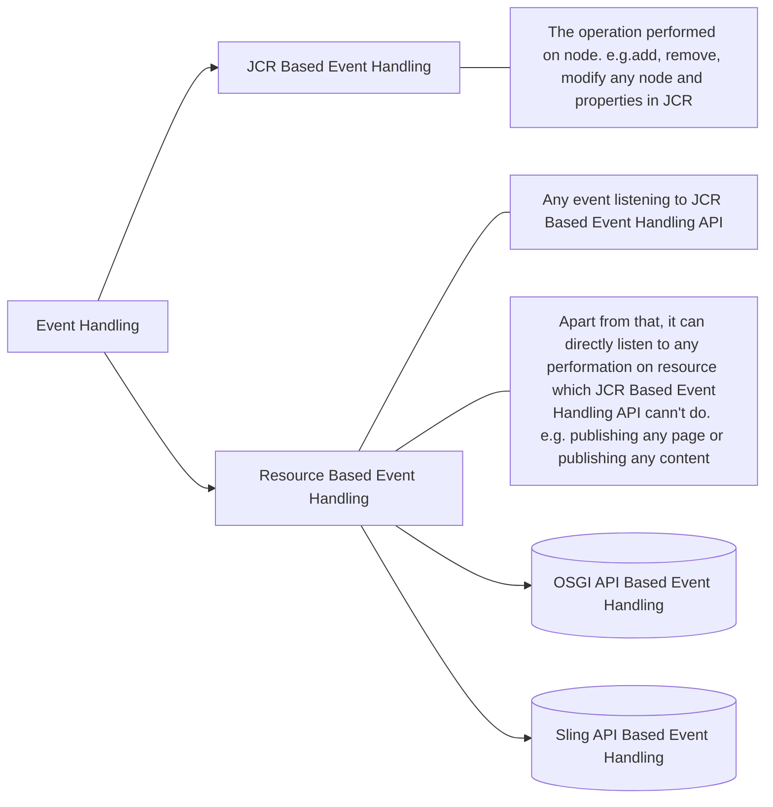
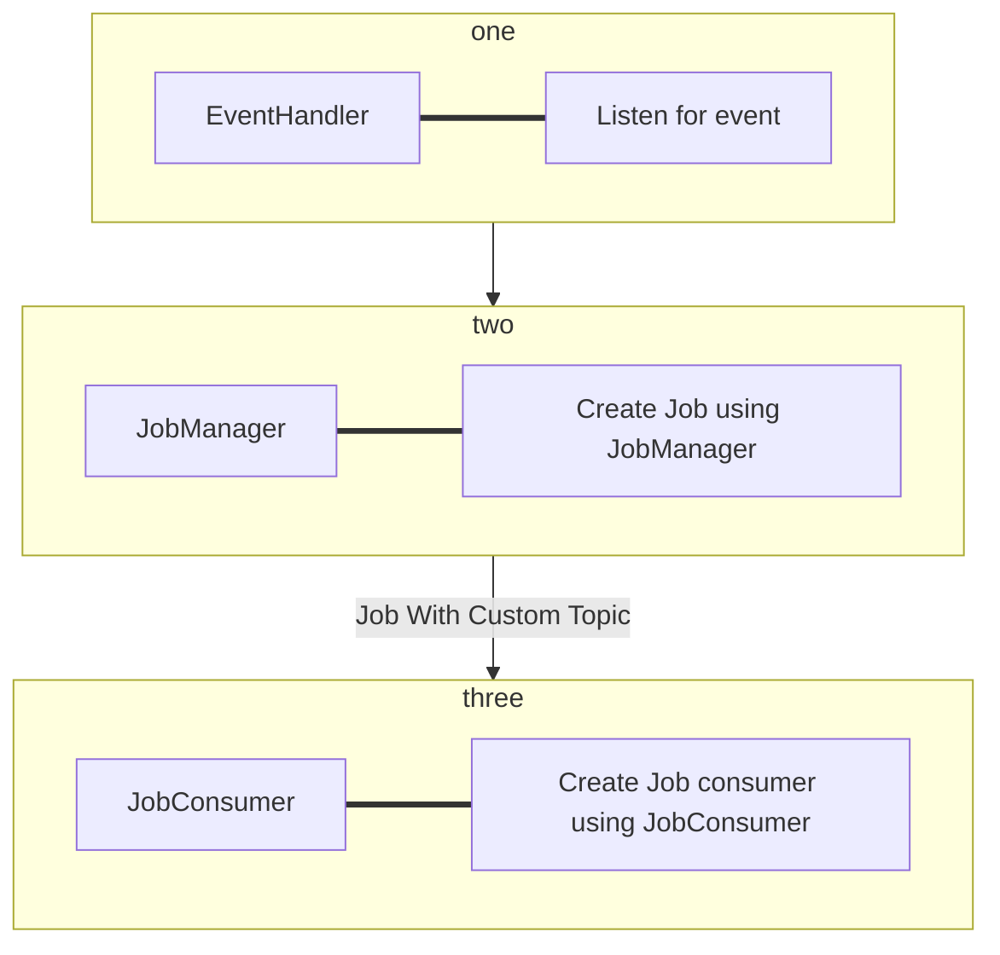

# Event Handling

## Event Handling Type in AEM

## Event Handling Types and Frameworks

>Note: The above event APIs except Sling JobManager/JobConsumer provides no status info.

### JCR Event Handling
- Event handling at JCR/Repository level.
-	An EventListener can be registered via the ObservationManager object.
-	Event listeners are notified asynchronously, and see events after they occur and the transaction is committed.
-	An event listener only sees events for which the session that registered it has sufficient access rights.

### Sling JobManager/JobConsumer

