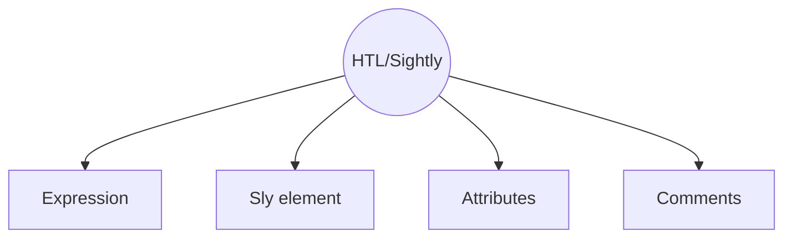
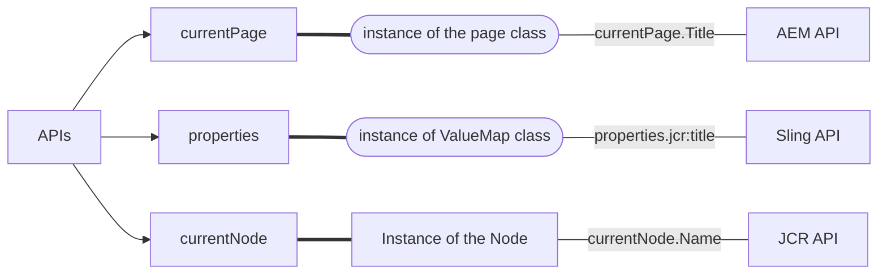

# HTML Temlaplate Language (HTL) / Sightly

## [What is HTL?](https://experienceleague.adobe.com/docs/experience-manager-htl/using/getting-started/update.html?lang=en)

- Templating language working in Server side
- HTL is HTML5
- Alternative of JSP

## HTL syntax


### Comments
```html
html comments: <!----> (remain in browser)
htl/sightly comments: <!--/* This is htl comments */--> (recommended, removed in browser)

```

### Expressions

- written in `${}`
- used in attrbites, element content and comments

### Sly Element

- removed from output


### Slighty attribute
>Start with data, please see [block statements](https://experienceleague.adobe.com/docs/experience-manager-htl/using/htl/block-statements.html?lang=en)
```
...
data-sly-include
data-sly-test
data-sly-text
data-sly-list
data-sly-repeat
...
```

### Predefined objects


#### How to use predefined objects?

```html
	<h1>Hello World!!</h1>
	<h3>Sling PropertiesObject</h3>
	<p>Page Title : ${properties.jcr:title}</p>

	<h3>Page Details</h3>
	<p>currentPage Title: ${currentPage.Title}</p>
	<p>currentPage Name: ${currentPage.Name}</p>
	<p>currentPage Path: ${currentPage.Path}</p>
	<p>currentPage Depth: ${currentPage.Depth}</p>

	<h3> Node Details </h3>
	<p>currentNode Name: ${currentNode.Name}</p>
	<p>currentNode Path: ${currentNode.Path}</p>
	<p>currentNode Depth: ${currentNode.Depth}</p>
```
