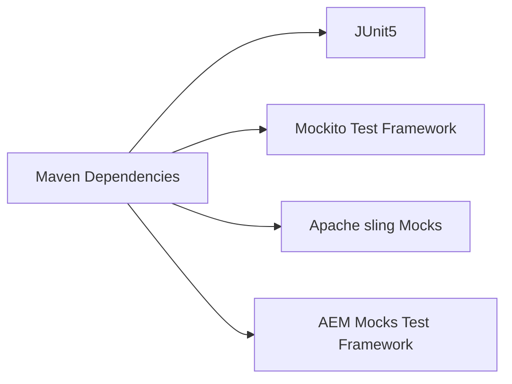

# Sling Model Unit Test

> More details, please see [Sling Model Unit Test](https://experienceleague.adobe.com/docs/experience-manager-learn/getting-started-wknd-tutorial-develop/project-archetype/unit-testing.html?lang=en)

## Step1: Inspect Maven Dependencies

## Step2: Writing Test class
