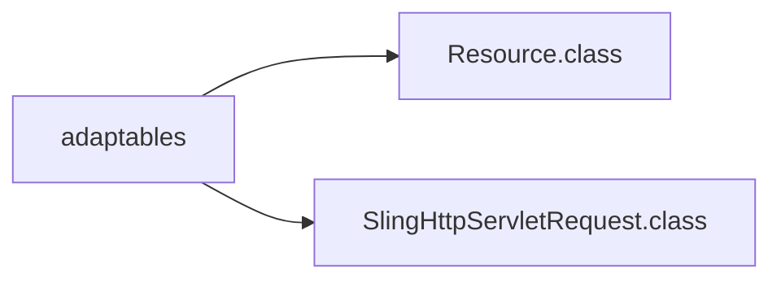
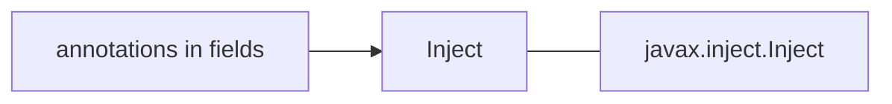

# Sling Model

Sling Models are "pure" POJOs which maps Sling objects (resources, request objects etc.). Since Sling Models are annotation-driven Plain Old Java Objects (POJOs), annotations are used a lot. They allow you to map resource properties, assign default values, inject OSGi services and much more.


## Sling model in AEM
{width=800}
<p><sup>- image from <a href="https://www.youtube.com/c/AEMGeeks" target="_blank">AEM GEEKS</a></sup></p>

## Component implementation
{width=800}
<p><sup>- image from <a href="https://www.youtube.com/c/AEMGeeks" target="_blank">AEM GEEKS</a></sup></p>


## @Model() annotation
```java
@Model(
	adaptables = Resource.class
	adapters = InterfaceName.class
)


# `adaptables` defines which resource object can be adapted to and how the sling mode behave
# `adapters` - defined interface

```

### adaptables



### annotations in fields

