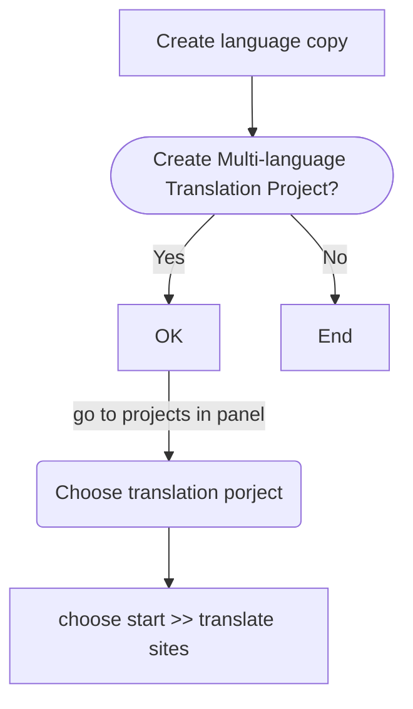

# MSM - Multi Sites Management

Set -DsingleCountry=n in maven-archetype  
Note:  All screenshots in this page are from <a href="https://www.youtube.com/c/AEMGeeks" target="_blank">AEM GEEKS</a>

## Create a language master

> - which contains all language copy
> - can be renamed anything,
> - official recommended.

1. Create a default language site (typically English)
   {width=600}
2. Make a language copy for other languages.
   {width=600}
    
   Select `Create Multi-language Translation Project` 
   {width=600}

3. Create sites for specific country.
   {width=800}

## AEM sites translation
> For more details, please see [aem geeks tutorial](https://www.youtube.com/watch?v=MMtS8ag6OUE&list=PLEaEQSM_Y4tmJjQICTFDm2lU5mNmd_Oar&index=25&ab_channel=AEMGEEKS)

