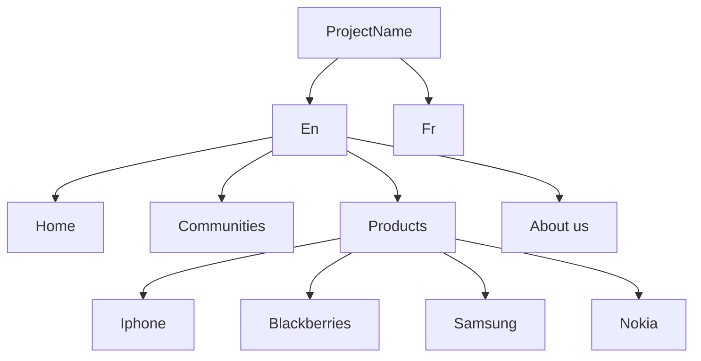

# Navigation
> More info please see [Core navigation component](https://www.aemcomponents.dev/content/core-components-examples/library/core-structure/navigation.html) and [How to build a navigation in AEM.](https://experienceleague.adobe.com/docs/experience-manager-core-components/using/components/navigation.html?lang=en)

## Website structure


## Code Snippets
```html
<div data-sly-resource="${'site-topnav' @ resourceType='projectName/components/content/site-topnav.html'}"></div>

<li class="nav nav-bar" data-sly-repeat="${currentPage.listChildren}">
  <a href="${item.path}.html">${item.title}</a>
</li>

```
