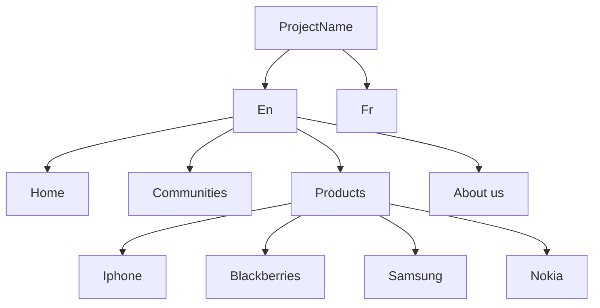

# Navigation
> More info please see [Core navigation component](https://www.aemcomponents.dev/content/core-components-examples/library/core-structure/navigation.html) and [How to build a navigation in AEM.](https://experienceleague.adobe.com/docs/experience-manager-core-components/using/components/navigation.html?lang=en)

## Website structure


## Code Snippets
```html
<div data-sly-resource="${'site-topnav' @ resourceType='projectName/components/content/site-topnav.html'}"></div>

<li class="nav nav-bar" data-sly-repeat="${currentPage.listChildren}">
  <a href="${item.path}.html">${item.title}</a>
</li>

```
## Create a complex component with java helper

> Create a `TopNav.java` with the same folder as `site-topnav.html`. other option is creating java class bundle. 
```bash
├──apps
│	├──project name
│		├──components
│			├──content
│              ├──site-topnav
│                         ├──site-topnav.html
│                         └──TopNav.java 
│			└──structure
│		└──templates 
|──content
```

*Note:* in AEM 6.5 before

### Java Helper
```java
package apps.training.components.content.site_topnav;

import java.util.*;
import java.util.Iterator;
import com.day.cq.wcm.api.Page;
import com.day.cq.wcm.api.PageFilter;

import com.adobe.cq.sightly.WCMUsePojo;

public class TopNav extends WCMUsePojo{
    private List<Page> items = new ArrayList<Page>();
    private Page rootPage;

    // Initializes the navigation
    @Override
    public void activate() throws Exception {
        rootPage = getCurrentPage().getAbsoluteParent(2);

        if (rootPage == null) {
        	rootPage = getCurrentPage();
        }
        
        Iterator<Page> childPages = rootPage.listChildren(new PageFilter(getRequest()));
	   	while (childPages.hasNext()) {
			items.add(childPages.next());
	   	}
    }

    // Returns the navigation items
    public List<Page> getItems() {
        return items;
    }
    // Returns the navigation root
    public Page getRoot() {
        return rootPage;
    }
}
```

```html
<!-- /* Add the business logic*/ -->
<div data-sly-use.topnav="TopNav" class="container we-Container--top-navbar">
    <nav class="navbar navbar-inverse navbar-absolute-top">
        <div class="navbar-header">
            <button type="button" class="navbar-toggle collapsed" data-toggle="collapse" data-target="#we-example-navbar-collapse-inverse" aria-expanded="false">
                <span class="sr-only">Toggle navigation</span>
                <span class="icon-bar"></span> <span class="icon-bar"></span>
            </button>
            <button type="button" class="navbar-toggle navbar-toggle-close collapsed" data-toggle="collapse" data-target="#we-example-navbar-collapse-inverse" aria-expanded="false">
                <span class="sr-only">Toggle navigation</span>
            </button>
            <a class="navbar-brand" href="${topnav.root.path}.html">we.<strong>train</strong></a>
            <div class="pull-right visible-xs"></div>
        </div>

        <!-- /.navbar-header -->
        <div class="collapse navbar-collapse width" id="we-example-navbar-collapse-inverse">
            <ul class="nav navbar-nav navbar-center">
                <li class="visible-xs"><a href="${topnav.root.path}.html">we.<strong class="text-primary">train</strong></a></li>

                <!-- /* Nav with business logic */ -->
                <li class="nav navbar-nav navbar-left" data-sly-repeat="${topnav.items}">
                    <a href="${item.path}.html">${item.title}</a>
                </li>

                <li class="visible-xs divider" role="separator"></li>
            </ul>
        </div>
        <span style="height: 0px;" class="navbar-shutter"></span>
    </nav>
    <!-- /.navbar -->
</div>
```
## Creating a navigation using JavaScript Helper

### Javascript Use-API
```mermaid

a[Javascript Use-API] --> a1[currentNode] & a2[currentPage]

```

