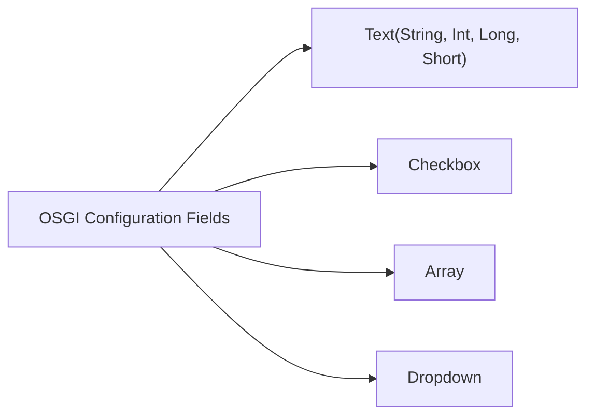
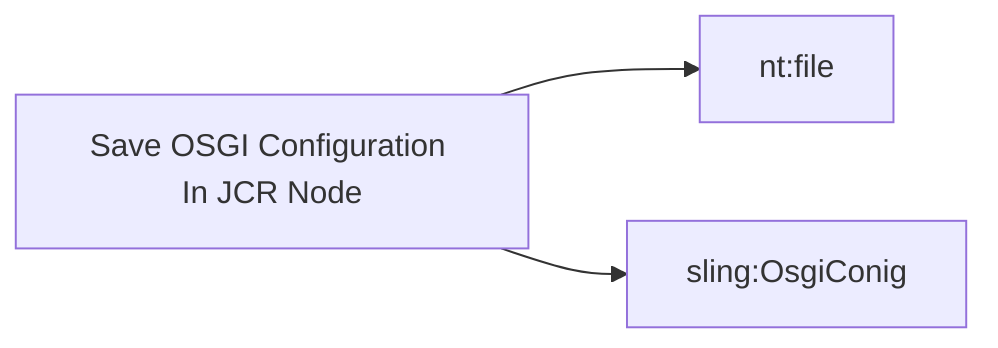
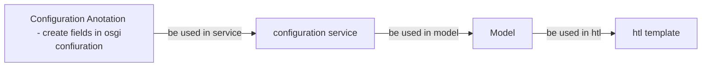
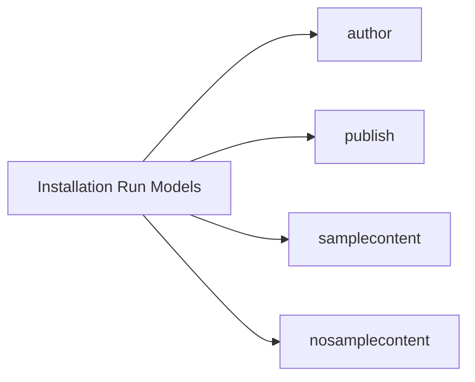
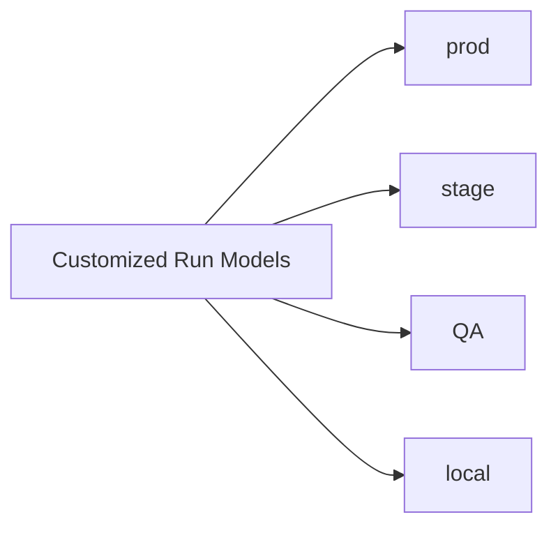

# OSGI Configuration

## OSGI Configuration Fields



## Save OSGI Configuration In JCR Node



<details>
<summary>OSGI Configuration Demo</summary>
```java
//create config annotation using @Configuration
 @ObjectClassDefinition(name="AEM Geeks - Modular OSGi Configuration", description = "Modular OSGi Configuration demo.") 
 public @interface GeeksOSGiConfig {
        @AttributeDefinition(
                name = "Service ID",
                description = "Enter service id.",
                type = AttributeType.INTEGER)
        int serviceID();

        @AttributeDefinition(
                name = "Service Name",
                description = "Enter service name.",
                type = AttributeType.STRING)
        public String serviceName() default "AEM Geeks Service";

        @AttributeDefinition(
                name = "Service URL",
                description = "Add Service URL.",
                type = AttributeType.STRING
        )
        String serviceURL() default "localhost";
    }

}

```

```java
// use config annotation in service
@Component(service = OSGiConfigModule.class,immediate = true)
@Designate(ocd = GeeksOSGiConfig.class)
public class OSGiConfigModuleImpl implements OSGiConfigModule{

    private int serviceId;
    private String serviceName;
    private String serviceURL;

    @Activate
    protected void activate(GeeksOSGiConfig geeksOSGiConfig){
        serviceId=geeksOSGiConfig.serviceID();
        serviceName=geeksOSGiConfig.serviceName();
        serviceURL=geeksOSGiConfig.serviceURL();
    }
    @Override
    public int getServiceId() {
        return serviceId;
    }
    @Override
    public String getServiceName() {
        return serviceName;
    }
    @Override
    public String getServiceURL() {
        return serviceURL;
    }
}
```

</details>

### Factory Configuration


<details>
<summary>Demo</summary>
```java
//Config Anotation
@ObjectClassDefinition(name="AEM Geeks - OSGi Factory Configuration",
        description = "OSGi Factory Configuration demo.")
public @interface GeeksOSGiFactoryConfig {
    @AttributeDefinition(
            name = "Config ID",
            description = "Enter service id.",
            type = AttributeType.INTEGER)
    int configID();

    @AttributeDefinition(
            name = "Service Name",
            description = "Enter service name.",
            type = AttributeType.STRING)
    public String serviceName() default "Service #";

    @AttributeDefinition(
            name = "Service URL",
            description = "Add Service URL.",
            type = AttributeType.STRING
    )
    String serviceURL() default "URL #";

}

```

```java
// ConfigService

@Component (service = OSGiFactoryConfig.class,configurationPolicy = ConfigurationPolicy.REQUIRE)
@Designate (ocd = GeeksOSGiFactoryConfig.class, factory = true)
public class OSGiFactoryConfigImpl implements OSGiFactoryConfig {
    ...
    private int configID;
    private String serviceName;
    private String serviceURL;
    private List<OSGiFactoryConfig> configsList;

    @Activate
    @Modified
    protected void activate(final GeeksOSGiFactoryConfig config) {
        configID = config.configID();
        serviceName=config.serviceName();
        serviceURL=config.serviceURL();
    }

    @Reference(service = OSGiFactoryConfig.class, cardinality = ReferenceCardinality.MULTIPLE, policy = ReferencePolicy.DYNAMIC)
    public void bindOSGiFactoryConfig(final OSGiFactoryConfig config) {
        if (configsList == null){
            configsList = new ArrayList<>();
        }
        configsList.add(config);
    }

    public void unbindOSGiFactoryConfig(final OSGiFactoryConfig config) {
        configsList.remove(config);
    }
    @Override
    public int getConfigID() {
        return configID;
    }
    @Override
    public String getServiceName() {
        return serviceName;
    }
    @Override
    public String getServiceURL() {
        return serviceURL;
    }

    @Override
    public List<OSGiFactoryConfig> getAllConfigs(){
        return configsList;
    }

    @Override
    public OSGiFactoryConfig get(int configID) {
        for (OSGiFactoryConfig confFact : configsList) {
            if (configID==confFact.getConfigID())
                return confFact;
        }
        return null;
    }
}

```

```java
//Config Model
@Model(adaptables = SlingHttpServletRequest.class,
        adapters = OSGiConfigDemo.class,
        defaultInjectionStrategy = DefaultInjectionStrategy.OPTIONAL)
public class OSGiConfigDemoImpl implements OSGiConfigDemo{

    /*--------Start Tutorial #31--------*/
    @OSGiService
    OSGiConfig oSGiConfig;

    @Override
    public String getServiceName() {
        return oSGiConfig.getServiceName();
    }

    @Override
    public int getServiceCount() {
        return oSGiConfig.getServiceCount();
    }

    @Override
    public boolean isLiveData() {
        return oSGiConfig.isLiveData();
    }

    @Override
    public String[] getCountries() {
        return oSGiConfig.getCountries();
    }

    @Override
    public String getRunModes() {
        return oSGiConfig.getRunModes();
    }
    /*--------End Tutorial #31--------*/

    /*--------Start Tutorial #32--------*/
    @OSGiService
    OSGiConfigModule oSGiConfigModule;

    @Override
    public int getServiceId() {
        return oSGiConfigModule.getServiceId();
    }
    @Override
    public String getServiceNameModule() {
        return oSGiConfigModule.getServiceName();
    }
    @Override
    public String getServiceURL() {
        return oSGiConfigModule.getServiceURL();
    }
    /*--------End Tutorial #32--------*/

    /*--------Start Tutorial #33--------*/
    @OSGiService
    OSGiFactoryConfig oSGiFactoryConfig;

    @Override
    public List<OSGiFactoryConfig> getAllOSGiConfigs() {
        return oSGiFactoryConfig.getAllConfigs();
    }
}
```
</details>


## Run Models in AEM




### Set Run Models in AEM
{width=600}

### OSGI Configuration with Run Models
{width=600}

### Config Folders
{width=600}
{width=600}
