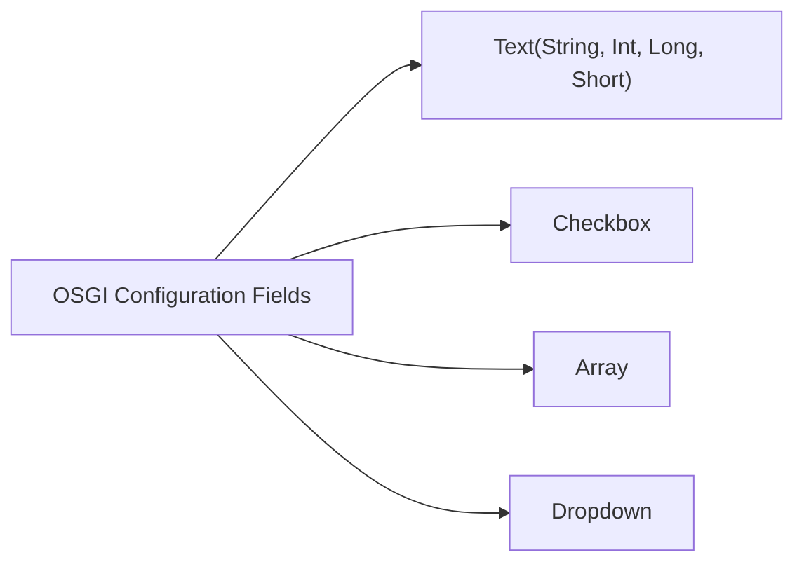
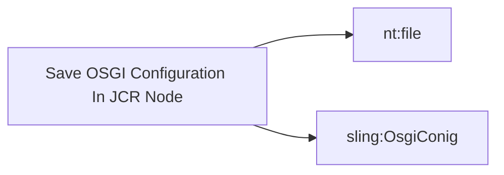

# OSGI Configuration

## OSGI Configuration Fields

```mermaid
flowchart LR

a["OSGI Configuration Fields"] --> a1["Text(String, Int, Long, Short)"]
a --> a2["Checkbox"]
a --> a3["Array"]
a --> a4["Dropdown"]
```

## Save OSGI Configuration In JCR Node

```mermaid
flowchart LR

a["Save OSGI Configuration In JCR Node"] --> a1["nt:file"]
a --> a2["sling:OsgiConig"]
```

### OSGI Configuration Demo

