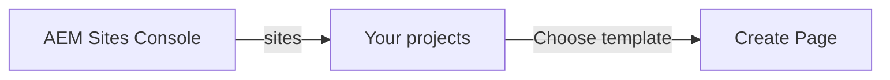
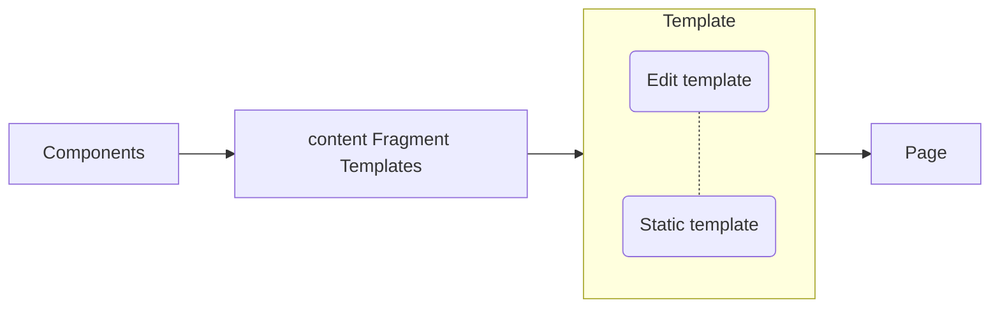

# Page

## How to create an AEM Sites page?

```mermaid
	flowchart LR
	a[AEM Sites Console] --> |sites| b[Your projects] -->|Choose template| c[Create Page]
```

## RelationShip 

```mermaid
	flowchart LR
	Components --> e[content Fragment Templates]
	subgraph Template
		direction TB
		d(Edit template) -.- c(Static template)
	end
	e-->Template--> Page
```

### Adding thumbnail for page
`Go to page in aem panel` >>> `View Properties` >>> `Thumbnail` >>> `upload an image`