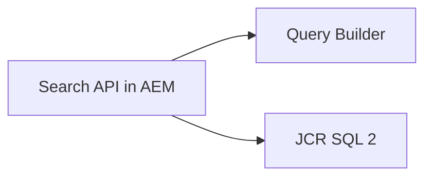
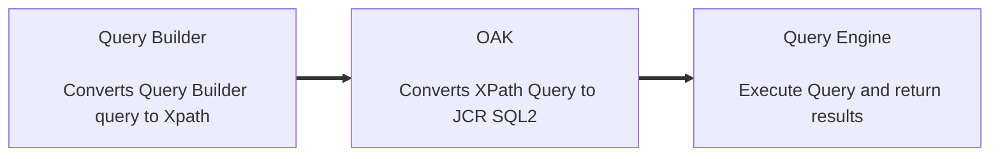

# AEM Query Builder  

> AEM query builder is a tool/framework developed by adobe for writing simple and efficient queries in aem.   
> AEM Query Buidler Debugger Console - localhost:4502/libs/cq/search/content/querydebug.html   
> For more information, please see [AEM Query Builder API](https://experienceleague.adobe.com/docs/experience-manager-64/developing/platform/query-builder/querybuilder-api.html?lang=en) AND [JCR query](https://jackrabbit.apache.org/oak/docs/query/grammar-xpath.html)

## Two Search APIs  In AEM

## How Query Builder works?

