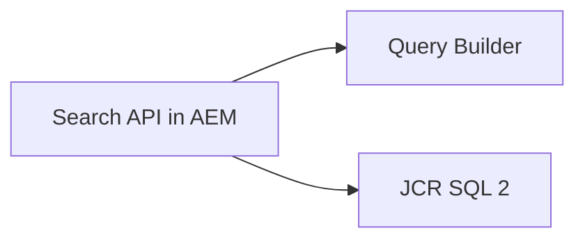
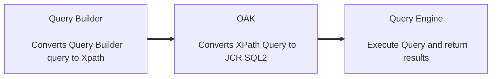

# AEM Query Builder  

> AEM query builder is a tool/framework developed by adobe for writing simple and efficient queries in aem. <br><br>
>  Use this tool for dry run for your aem queries optimize them and then implement it in the code. <br><br>
> AEM Query Builder debugger URL:- http://localhost:4502/libs/cq/search/content/querydebug.html <br><br>
> For more information, please see [AEM Query Builder API](https://experienceleague.adobe.com/docs/experience-manager-64/developing/platform/query-builder/querybuilder-api.html?lang=en) AND [JCR query](https://jackrabbit.apache.org/oak/docs/query/grammar-xpath.html)

## Two Search APIs  In AEM


## How Query Builder works?

> Just a note AEM Query Builder is not:  <br>
- A query engine itself (relies on JCR queries) <br>
- does not have its own search index (relies on Oak indexes)<br>
- or even cache (except a simple facet cache)<br>

## Debugging AEM Query Logs:
- Navigate to http://localhost:4502/system/console/slinglog.
- Click on Add new logger (It might be useful to create a new log file for query, you can use any existing log file also.)
	- Enter Log file Name(query.log).
	- Set Log level to Debug or Trace.
	- TRACE will also show filtering per node (useful when writing custom filtering)
	- Avoid DEBUG or lower log level in production environment.
	- Add below 3 class files for debugging.
		1. com.day.cq.search
		2. org.apache.jackrabbit.oak.plugins.index
		3. org.apache.jackrabbit.oak.query

## Test in Query builder console
<details>
<summary>
Step1: type=dam:Asset
</summary>

</details>

<details>
<summary>
Step2: Go to query.log file that we have created. [http://localhost:4502/system/console/slinglog/tailer.txt?tail=1000&name=%2Flogs%2Fquery.log]. You can see below logs specifying the query execution time, cost, index used and you can check how oak is converting xpath queries to SQL2 internally. 
</summary>

</details>

## AEM Query Structure
> Note:- Base on Predicate type, internally a predicate evaluator is resolved, which handles mapping of query to xpath, filtering of results, custom ordering if specified and facet extraction. 

- Predicates – If no parameter is provided, predicate type is mirrored in final query
- Parameter – Predicate Parameter
- Value – Value of predicate <br><br>


### Handle Multiple Predicates of same Type:
- Fixed numbering scheme
- Name = number_type
- Allows to define an order


> For more information about `AEM Standard Predicates`, to see aem predicates list at [link 1](https://getpocket.com/read/1886976129) or [link 2](http://www.aemcq5tutorials.com/tutorials/adobe-aem-cq5-tutorials/aem-query-builder)

## Query Builder Java API


<details>
<summary>demo</summary>
<strong>search service</strong>
```java
@Component(service = SearchService.class, immediate = true)
public class SearchServiceImpl implements SearchService{

    private static final Logger LOG= LoggerFactory.getLogger(SearchServiceImpl.class);

    @Reference
    QueryBuilder queryBuilder;

    @Reference
    ResourceResolverFactory resourceResolverFactory;

    @Activate
    public void activate(){
        LOG.info("\n ----ACTIVATE METHOD----");
    }

    public Map<String,String> createTextSearchQuery(String searchText,int startResult,int resultPerPage){
        Map<String,String> queryMap=new HashMap<>();
        queryMap.put("path","/content/we-retail");
        queryMap.put("type","cq:Page");
        queryMap.put("fulltext",searchText);
        queryMap.put("p.offset",Long.toString(startResult));
        queryMap.put("p.limit",Long.toString(resultPerPage));
        return queryMap;
    }

    @Override
    public JSONObject searchResult(String searchText,int startResult,int resultPerPage){
        LOG.info("\n ----SEARCH RESULT--------");
        JSONObject searchResult=new JSONObject();
        try {
            ResourceResolver resourceResolver = ResolverUtil.newResolver(resourceResolverFactory);
            final Session session = resourceResolver.adaptTo(Session.class);
            Query query = queryBuilder.createQuery(PredicateGroup.create(createTextSearchQuery(searchText,startResult,resultPerPage)), session);


            SearchResult result = query.getResult();

            int perPageResults = result.getHits().size();
            long totalResults = result.getTotalMatches();
            long startingResult = result.getStartIndex();
            double totalPages = Math.ceil((double) totalResults / (double) resultPerPage);

            searchResult.put("perpageresult",perPageResults);
            searchResult.put("totalresults",totalResults);
            searchResult.put("startingresult",startingResult);
            searchResult.put("pages",totalPages);


            List<Hit> hits =result.getHits();
            JSONArray resultArray=new JSONArray();
            for(Hit hit: hits){
                Page page=hit.getResource().adaptTo(Page.class);
                JSONObject resultObject=new JSONObject();
                resultObject.put("title",page.getTitle());
                resultObject.put("path",page.getPath());
                resultArray.put(resultObject);
                LOG.info("\n Page {} ",page.getPath());
            }
            searchResult.put("results",resultArray);

        }catch (Exception e){
            LOG.info("\n ----ERROR -----{} ",e.getMessage());
        }
        return searchResult;
    }
}
```
<strong> serach servlet</strong>
```java
@Component(service = Servlet.class)
@SlingServletPaths(
        value = {"/geeks/search"}
)
public class GeeksSearchServlet extends SlingAllMethodsServlet {
    private static final Logger LOG = LoggerFactory.getLogger(GeeksSearchServlet.class);

    @Reference
    SearchService searchService;

    @Override
    protected void doGet(final SlingHttpServletRequest req, final SlingHttpServletResponse resp) throws ServletException, IOException {
        JSONObject searchResult=null;
        try {
            String searchtext = req.getRequestParameter("searchText").getString();
            int pageNumber = Integer.parseInt(req.getRequestParameter("pageNumber").getString())-1;
            int resultPerPage = Integer.parseInt(req.getRequestParameter("resultPerPage").getString());
            int startResult=pageNumber*resultPerPage;
            searchResult=searchService.searchResult(searchtext,startResult,resultPerPage);
        } catch (Exception e) {
            LOG.info("\n ERROR {} ", e.getMessage());
        }

        resp.setContentType("application/json");
        resp.getWriter().write(searchResult.toString());
    }
}
```
</details>
