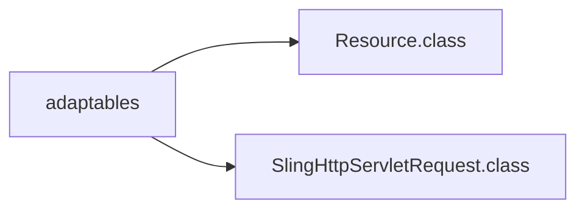
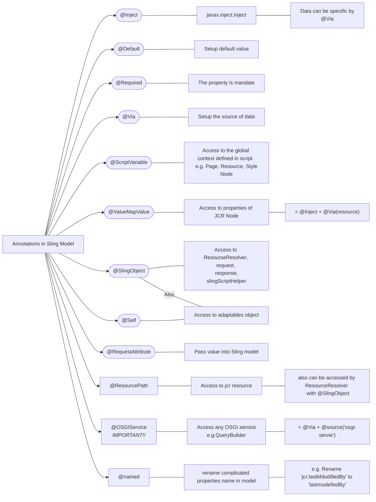

# Sling Model

Sling Models are "pure" POJOs which maps Sling objects (resources, request objects etc.). Since Sling Models are annotation-driven Plain Old Java Objects (POJOs), annotations are used a lot. They allow you to map resource properties, assign default values, inject OSGi services and much more.


{width=400}
<p><sup>- image from <a href="https://experienceleague.adobe.com/docs/experience-manager-learn/foundation/development/understand-sling-model-exporter.html?lang=en" target="_blank">adobe</a></sup></p>


## Sling model in AEM
{width=800}
<p><sup>- image from <a href="https://www.youtube.com/c/AEMGeeks" target="_blank">AEM GEEKS</a></sup></p>

## Component implementation
{width=800}
<p><sup>- image from <a href="https://www.youtube.com/c/AEMGeeks" target="_blank">AEM GEEKS</a></sup></p>


## @Model() annotation
```java
@Model(
	adaptables = Resource.class
	adapters = InterfaceName.class
)


# `adaptables` defines which resource object can be adapted to and how the sling mode behave
# `adapters` - defined interface

```

### adaptables



### Annotations in Sling Model


<details>
  <summary>demo code</summary>
	*code from *
```java
package com.aem.geeks.core.models.impl;

import com.aem.geeks.core.models.Author;
import com.day.cq.wcm.api.Page;
import com.fasterxml.jackson.annotation.JsonIgnore;
import com.fasterxml.jackson.annotation.JsonProperty;
import com.fasterxml.jackson.annotation.JsonRootName;
import org.apache.sling.api.SlingHttpServletRequest;
import org.apache.sling.api.resource.Resource;
import org.apache.sling.api.resource.ResourceResolver;
import org.apache.sling.models.annotations.*;
import org.apache.sling.models.annotations.injectorspecific.*;
import org.slf4j.Logger;
import org.slf4j.LoggerFactory;

import javax.inject.Inject;
import javax.inject.Named;
import java.util.*;

@Model(adaptables = SlingHttpServletRequest.class,
        adapters = Author.class,
        resourceType = AuthorImpl.RESOURCE_TYPE,
        defaultInjectionStrategy = DefaultInjectionStrategy.OPTIONAL
)

@Exporter(name = "jackson", extensions ="json",selector = "geeks",
        options = {
                @ExporterOption(name = "SerializationFeature.WRAP_ROOT_VALUE", value="true"),
                @ExporterOption(name = "MapperFeature.SORT_PROPERTIES_ALPHABETICALLY", value = "true")
        })

@JsonRootName("author-details")
public class AuthorImpl implements Author{
    private static final Logger LOG = LoggerFactory.getLogger(AuthorImpl.class);
    final protected static String RESOURCE_TYPE="aemgeeks/components/content/author";

    @Inject
    Resource resource;

    @SlingObject
    ResourceResolver resourceResolver;

    @Self
    SlingHttpServletRequest slingHttpServletRequest;

    @RequestAttribute(name = "rAttribute")
    private String reqAttribute;

    @ResourcePath(path="/content/aemgeeks/us/en/home")@Via("resource")
    Resource resourcePage;

    @ScriptVariable
    Page currentPage;


    @Inject
    @Via("resource")
    @Named("jcr:lastModifiedBy")
    String modifiedBy;

    @Inject
    @Via("resource")
    @Default(values = "AEM")
    private String fname;

    @ValueMapValue
    @Default(values = "GEEKS")
    private String lname;

    @Inject
    @Via("resource")
    private boolean professor;


    @ValueMapValue
    private List<String> books;


    @Override
    public List<String> getBooks() {
        if (books != null) {
            return new ArrayList<String>(books);
        } else {
            return Collections.emptyList();
        }
    }

    @Override
    public String getFirstName() {
        return fname;
    }

    @Override
    public String getLastName() {
        return lname;
    }

    @Override
    public boolean getIsProfessor() {
        return professor;
    }

    @Override
    public String getPageTitle(){
        return currentPage.getTitle();
    }

    @Override
    @JsonIgnore
    public String getRequestAttribute() {
        return reqAttribute;
    }

    @Override
    public String getHomePageName(){
        return resourcePage.getName();
    }
    @Override
    public String getLastModifiedBy(){
        return modifiedBy;
    }

    @JsonProperty(value = "auhtor-name")
    public String authorName(){
        return "AEM GEEKS";
    }
    @Override
    public List<Map<String, String>> getBookDetailsWithMap() {
        List<Map<String, String>> bookDetailsMap=new ArrayList<>();
        try {
            Resource bookDetail=resource.getChild("bookdetailswithmap");
            if(bookDetail!=null){
                for (Resource book : bookDetail.getChildren()) {
                    Map<String,String> bookMap=new HashMap<>();
                    bookMap.put("bookname",book.getValueMap().get("bookname",String.class));
                    bookMap.put("booksubject",book.getValueMap().get("booksubject",String.class));
                    bookMap.put("publishyear",book.getValueMap().get("publishyear",String.class));
                    bookDetailsMap.add(bookMap);
                }
            }
        }catch (Exception e){
            LOG.info("\n ERROR while getting Book Details {} ",e.getMessage());
        }
        return bookDetailsMap;
    }

}


```  

</details>
