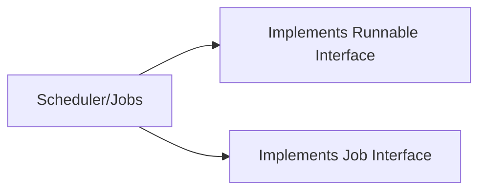

# Sling Scheduler
*Package - org.apache.sling.commons.scheduler*

## What is Sling Scheduler?
- A scheduler is a service to schedule jobs. 
- If we want some work to happen at a particular time or at a regular interval, then Schedulers are the way to go.

## Two ways to write scheduler
> 1. Whiteboard Pattern - In this, we create a Runnable thread to perform our task. This is similar to the Java Thread concept.
2. Scheduler API - In this, we use Apache Commons' Scheduler API to perform our task. It uses open-source [Quartz](http://www.quartz-scheduler.org/) library.



## Sling Scheduler in AEM
> - Create an OSGi configuration to read the scheduler specific values from the user i.e. cron expression, the name of the scheduler, custom parameter etc.
- Create a sling scheduler which displays the custom parameter at an interval specified by the cron expression.


## How to create a Scheudler

<details>
<summary>Step1: Create an OSGI configuration</summary>
```java
import org.osgi.service.metatype.annotations.AttributeDefinition;
import org.osgi.service.metatype.annotations.AttributeType;
import org.osgi.service.metatype.annotations.ObjectClassDefinition;

@ObjectClassDefinition(
        name = "AEM Geeks - Scheduler Configuration",
        description = "Sling scheduler configuration"
)
public @interface SchedulerConfiguration {

    @AttributeDefinition(
            name = "Scheduler name",
            description = "Name of the scheduler",
            type = AttributeType.STRING)
    public String schedulerName() default "Custom Sling Scheduler Configuration";

    @AttributeDefinition(
            name = "Cron Expression",
            description = "Cron expression used by the scheduler",
            type = AttributeType.STRING)
    public String cronExpression() default "0/20 * * * * ?"; // runs every 10 seconds
}

/*
*	maven dependency in pom.xml
*/
<dependency>
	<groupId>org.osgi</groupId>
	<artifactId>org.osgi.service.metatype.annotations</artifactId>
	<version>1.4.0</version>
	<scope>provided</scope>
</dependency>
```
</details>

<details>
<summary>Step2: Create an Scheduler class</summary>
```java
// ================ implements Runnable interface =========================

import com.aem.geeks.core.config.SchedulerConfiguration;
import org.apache.sling.commons.scheduler.ScheduleOptions;
import org.apache.sling.commons.scheduler.Scheduler;
import org.osgi.service.component.annotations.*;
import org.osgi.service.metatype.annotations.Designate;

@Component(immediate = true, service = Runnable.class)
@Designate(ocd = SchedulerConfiguration.class)
public class GeeksScheduler implements Runnable {
    private static final Logger LOG = LoggerFactory.getLogger(GeeksScheduler.class);

    private int schedulerId;

    @Reference
    private Scheduler scheduler;

    @Activate
    protected void activate(SchedulerConfiguration config) {
        schedulerId = config.schedulerName().hashCode();
        addScheduler(config);
    }

    @Deactivate
    protected void deactivate(SchedulerConfiguration config) {
        removeScheduler();
    }

    protected void removeScheduler() {
        scheduler.unschedule(String.valueOf(schedulerId));
    }

    protected void addScheduler(SchedulerConfiguration config) {
        ScheduleOptions scheduleOptions = scheduler.EXPR(config.cronExpression());
        scheduleOptions.name(String.valueOf(schedulerId));
        //scheduleOptions.canRunConcurrently(true);
        scheduler.schedule(this, scheduleOptions);
    }
   @Override
    public void run() {
       LOG.info("\n ====> RUN METHOD");
    }
}

// ================ implements Job interface =========================

import com.aem.geeks.core.config.SchedulerConfiguration;
import org.apache.sling.commons.scheduler.Job;
import org.apache.sling.commons.scheduler.JobContext;
import org.apache.sling.commons.scheduler.ScheduleOptions;
import org.apache.sling.commons.scheduler.Scheduler;
import org.osgi.service.component.annotations.Activate;
import org.osgi.service.component.annotations.Component;
import org.osgi.service.component.annotations.Deactivate;
import org.osgi.service.component.annotations.Reference;
import org.osgi.service.metatype.annotations.Designate;

import java.io.Serializable;
import java.util.HashMap;
import java.util.Map;

@Component(immediate = true, service = Job.class)
@Designate(ocd = SchedulerConfiguration.class)
public class GeeksSchedulerJobs implements Job {

    private int schedulerJobId;

    @Reference
    private Scheduler scheduler;

    @Activate
    protected void activate(SchedulerConfiguration config) {
        addSchedulerJob(config);
        schedulerJobId = config.schedulerName().hashCode();
    }

    @Deactivate
    protected void deactivate(SchedulerConfiguration config) {
        removeSchedulerJob();
    }

    private void removeSchedulerJob() {
        scheduler.unschedule(String.valueOf(schedulerJobId));
    }

    private void addSchedulerJob(SchedulerConfiguration config) {

        ScheduleOptions in = scheduler.EXPR("0 03 17 1/1 * ? *");
        Map<String, Serializable> inMap=new HashMap<>();
        inMap.put("country","IN");
        inMap.put("url","www.in.com");
        in.config(inMap);

        scheduler.schedule(this,in);
        ScheduleOptions de = scheduler.EXPR("0 04 17 1/1 * ? *");
        Map<String, Serializable> deMap=new HashMap<>();
        deMap.put("country","DE");
        deMap.put("url","www.de.com");
        de.config(deMap);
        scheduler.schedule(this,de);

        ScheduleOptions us = scheduler.EXPR("0 05 17 1/1 * ? *");
        Map<String, Serializable> usMap=new HashMap<>();
        usMap.put("country","US");
        usMap.put("url","www.us.com");
        us.config(usMap);
        scheduler.schedule(this,us);
    }

    @Override
    public void execute(JobContext jobContext) {
           LOG.info("\n =======> COUNTRY {} : URL {} ",jobContext.getConfiguration().get("country"),
                   jobContext.getConfiguration().get("url"));
    }
}
```
</details>
