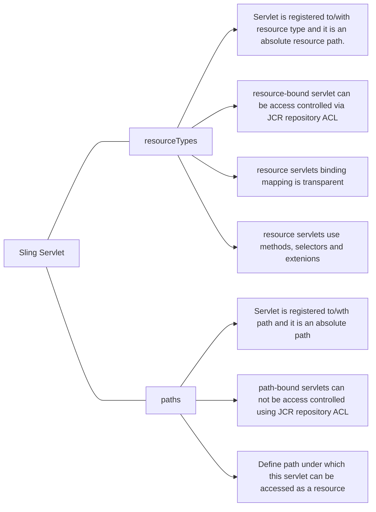
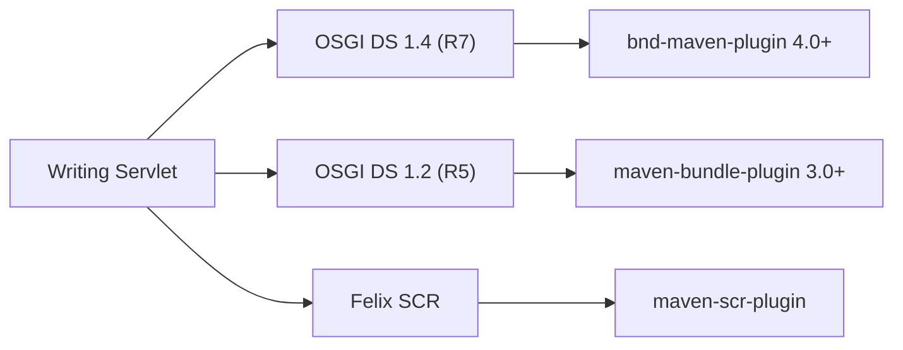
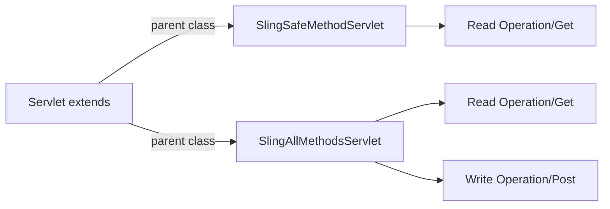

# Sling Servlet

## Servlet types


---

##  Writing Servlet


---

## Sling Servlet extends - interface


### Sevlet with OSGI DS 1.2 Demo


<details>
<summary>Sevlet with OSGI DS 1.2 Demo</summary>
```java
@Component(
        service= {Servlet.class},
        property={
                "sling.servlet.methods="+ HttpConstants.METHOD_GET,
                SLING_SERVLET_METHODS+"="+HttpConstants.METHOD_POST,
                "sling.servlet.resourceTypes="+ "aemgeeks/components/structure/geeks-home",
                SLING_SERVLET_PATHS+"="+"/geeks/r5servlet",
                "sling.servlet.selectors=" + "geeks",
                "sling.servlet.selectors=" + "ds",
                SLING_SERVLET_EXTENSIONS+"="+"xml",
                "sling.servlet.extensions"+"="+"txt"
        })
public class GeeksServlet extends SlingAllMethodsServlet {
    @Override
    protected void doGet(final SlingHttpServletRequest req, final SlingHttpServletResponse resp) throws ServletException, IOException {
          ... 
    }

    @Override
    protected void doPost(SlingHttpServletRequest req, SlingHttpServletResponse resp)
          ... 
    }
}
```
</details>


### Sevlet with OSGI DS 1.4 Demo


<details>
<summary>Sevlet with OSGI DS 1.4 Demo</summary>
```java
//Servlet By resourceType 
@Component(service = Servlet.class)
@SlingServletResourceTypes(
        methods = {HttpConstants.METHOD_GET,HttpConstants.METHOD_POST},
        resourceTypes = "aemgeeks/components/structure/page",
        selectors = {"geeks","test"},
        extensions = {"txt","xml"}
)
public class GeeksResourceTypesServlet extends SlingAllMethodsServlet {

    @Override
    protected void doGet(final SlingHttpServletRequest req,
                         final SlingHttpServletResponse resp) throws ServletException, IOException {
												 ...
    }
    @Override
    protected void doPost(SlingHttpServletRequest req, SlingHttpServletResponse resp)
            throws ServletException, IOException {
						 ...
		}
}
```
```java
//Servlet By Paths
@Component(service = Servlet.class)
@SlingServletPaths(
        value = {"/bin/pages","/geeks/pages"}
)
public class GeeksPathTypeServlet extends SlingAllMethodsServlet {

    @Override
    protected void doGet(final SlingHttpServletRequest req, final SlingHttpServletResponse resp) throws ServletException, IOException {
        ...    
    }

    @Override
    protected void doPost(SlingHttpServletRequest req, SlingHttpServletResponse resp)
            throws ServletException, IOException {
        ...
    }
}
```
</details>

#### ResourceType Sling Servlet Demo


#### Sling Servlet By ResourceType
> Note: The selectors and extensions must be used in servlets defined by resourceTypes if they are defined.
 


#### Sling Servlet By Paths
> Note: The path should be defined in `apache sling servlet/script resolver and error handler` of Sling Configuration.
> The selectors and extensions are not required in servlets defined by paths.


