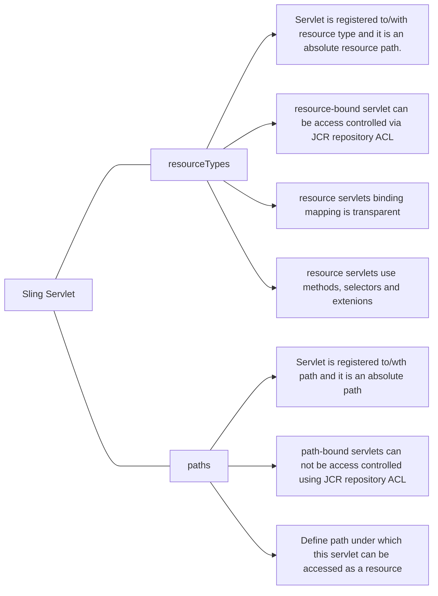
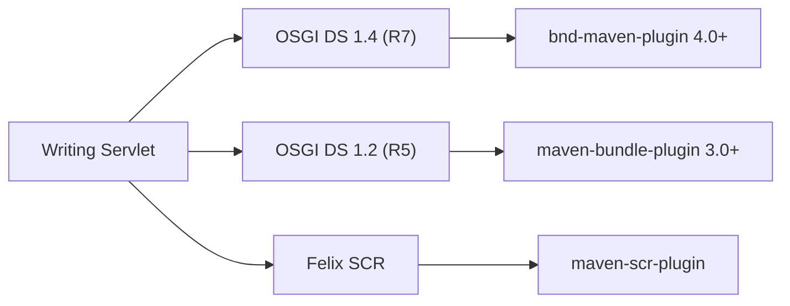
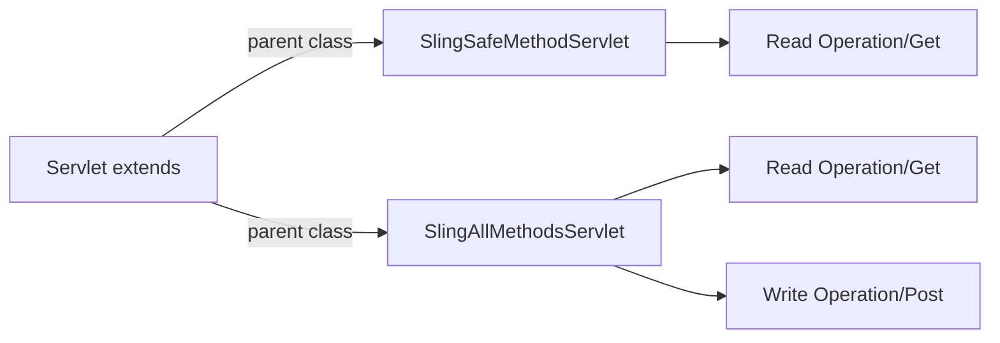

# Sling Servlet

## Servlet types


---

##  Writing Servlet


---

## Sling Servlet extends - interface


### Sevlet with OSGI DS 1.2 Demo
{width=600}

<details>
<summary>Sevlet with OSGI DS 1.2 Demo</summary>
```java


```
</details>


### Sevlet with OSGI DS 1.4 Demo
{width=600}

<details>
<summary>Sevlet with OSGI DS 1.4 Demo</summary>
```java


```
</details>

#### ResourceType Sling Servlet Demo
{width=600}
