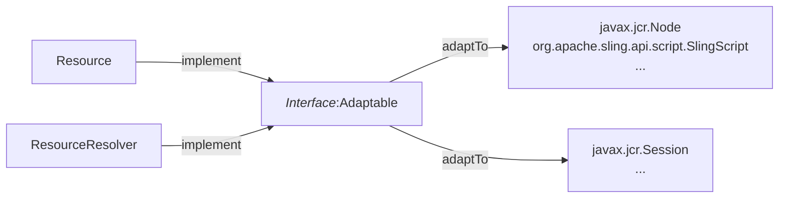

# Apache Sling Adapters


<strong>Example</strong>
```java
Node node = resource.adaptTo(Node.class);
```

## Interface Adaptable
> This interface provides a generic adaptTo() method that will translate the object to the class type being passed as the argument.

```java
/**
 * Adapts the adaptable to another type.
 *
 * @param <AdapterType> The generic type to which this resource is adapted
 *            to
 * @param type The Class object of the target type, such as
 *            <code>javax.jcr.Node.class</code> or
 *            <code>java.io.File.class</code>
 * @return The adapter target or <code>null</code> if the resource cannot
 *         adapt to the requested type
 */
<AdapterType> AdapterType adaptTo(Class<AdapterType> type);
```

## How to check possible Adaptation?
- Go to `web console`
    - `/system/console/adapters`
    - `/system/console/status-adapters`
