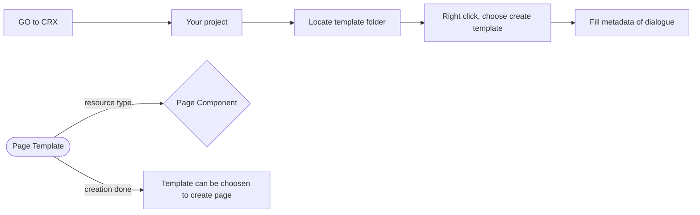
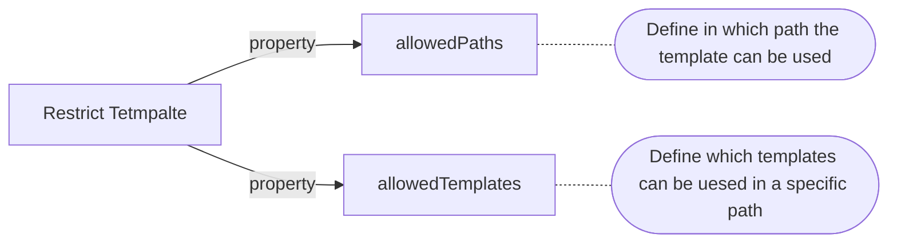
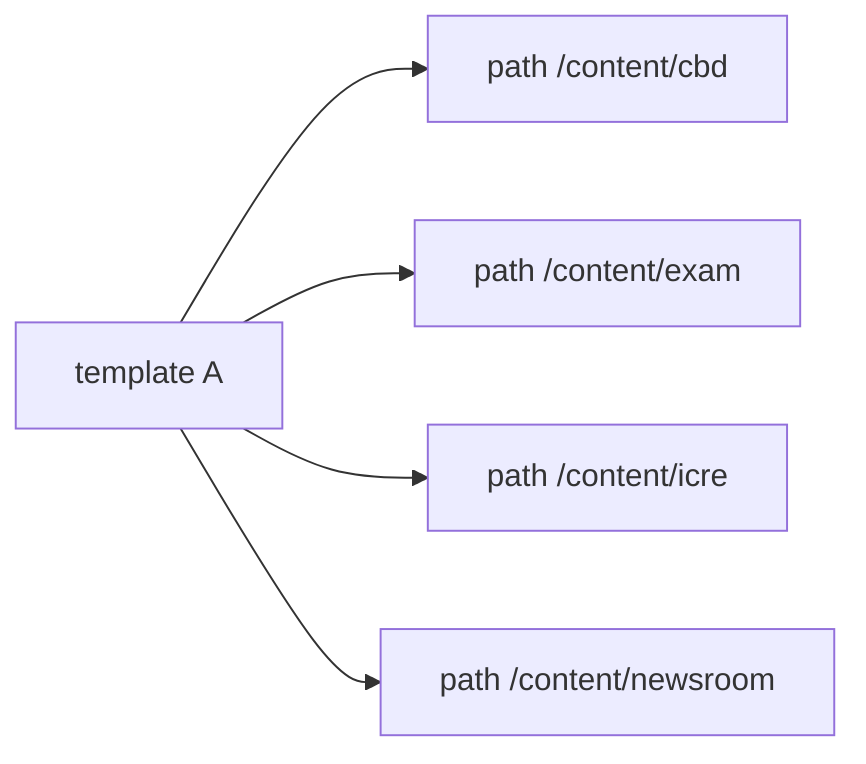
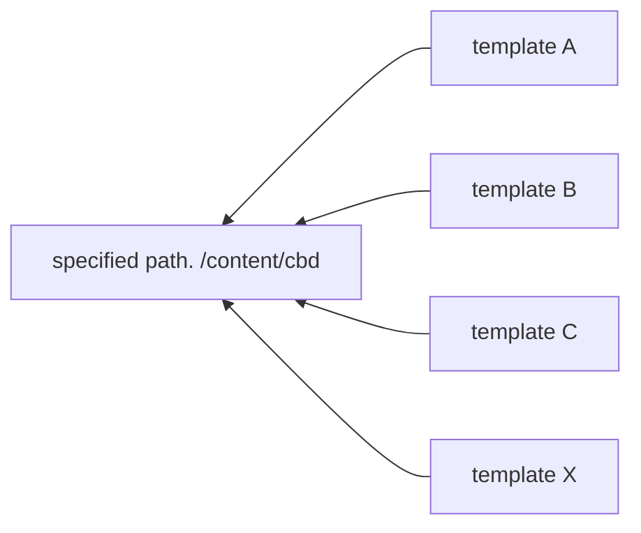

# Template

> *Blueprint/layout* - Template has the same hierarchy as page but with no content.   
> Be used to create a `page`.

## How to create a template?

## Restrict Template

### allowedPaths property
> Define in which path the `template` can be used

Examples:

- *allowedPaths: /content(/.\*)?*  - Any page can use this template
- *allowedPaths: /content/cbd(/.\*)?* - Only used in cbd sites.

### allowedTemplates property
> Define which templates can be uesed in a specific path
> 

