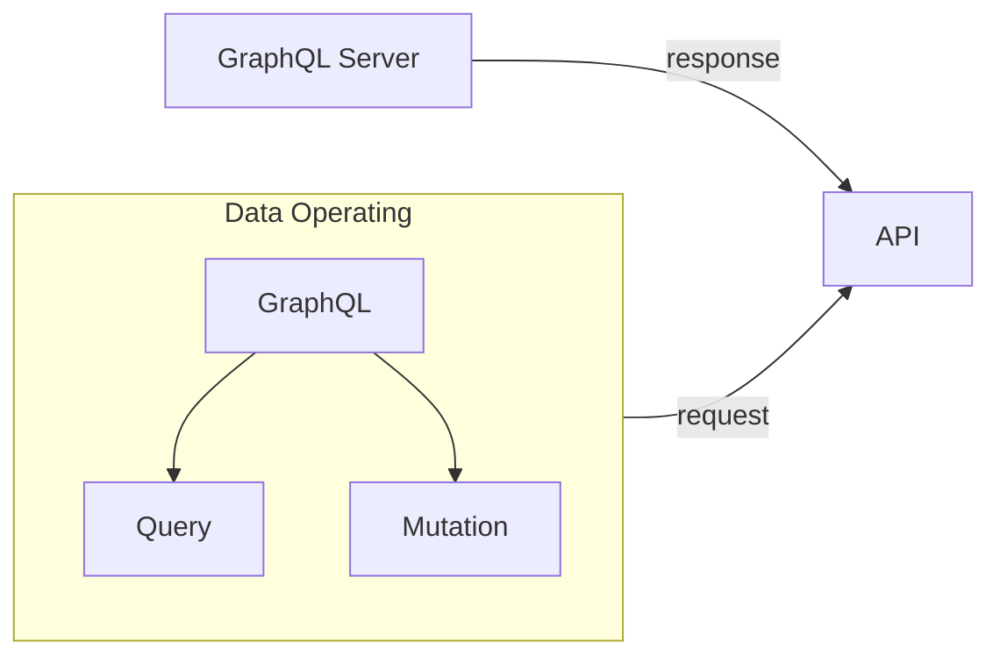

# GraphQL

> GraphQL is a query language for your APIs. graphql is independent and standardized. Any Progreming language can use GraphQL.

```mermaid
flowchart LR
    subgraph operation[Data Operating]
    direction TB
    GraphQL --> Query & Mutation
    end
    a[GraphQL Server] -->|response| API
    operation --> |request| API
```

