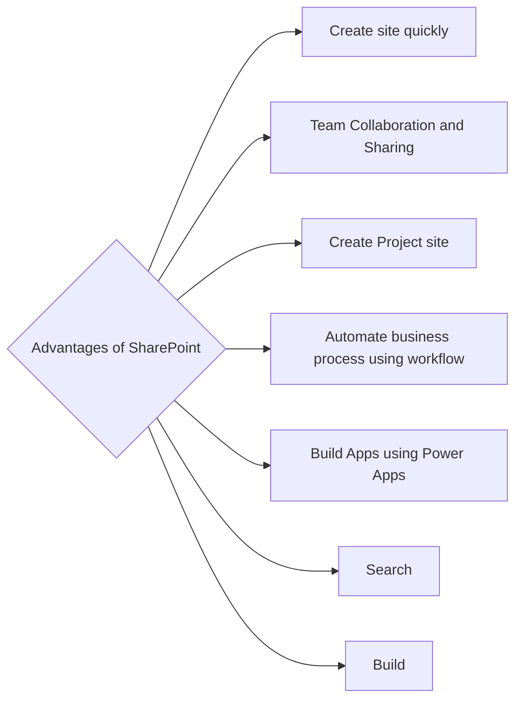
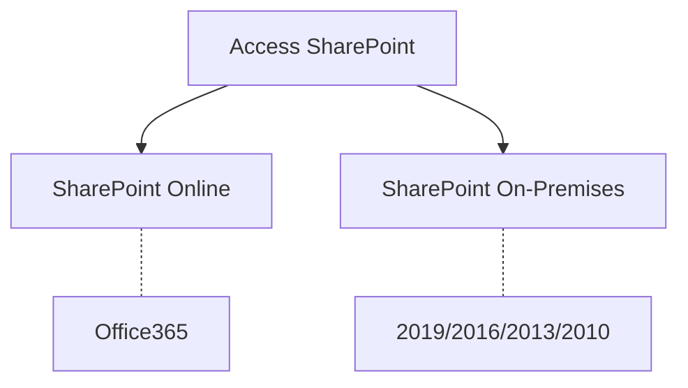

# Introduction

## What is SharePoint?

a technology used to increase team's collaboration. it is a browser-based collaboration and document management platform.

## Why we use SharePoint?

## How to access SharePoint?

